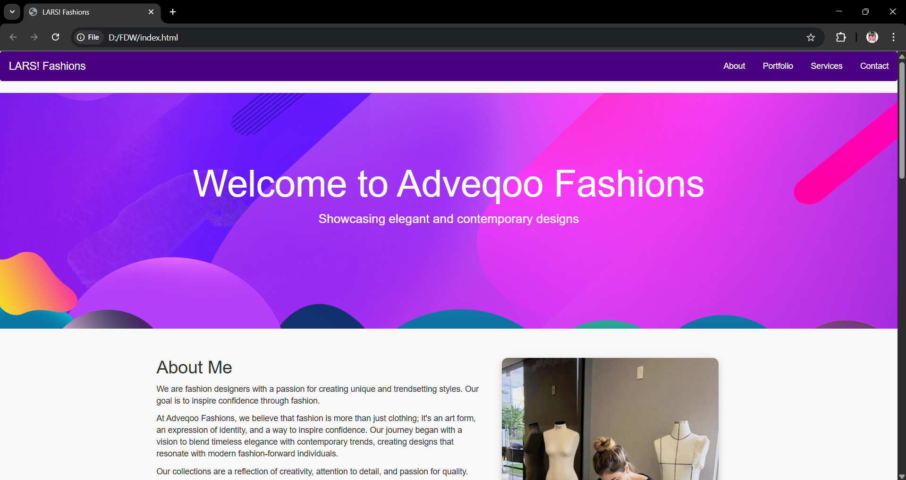
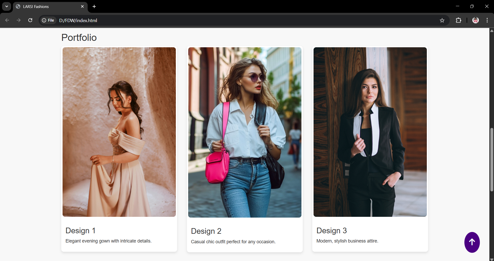
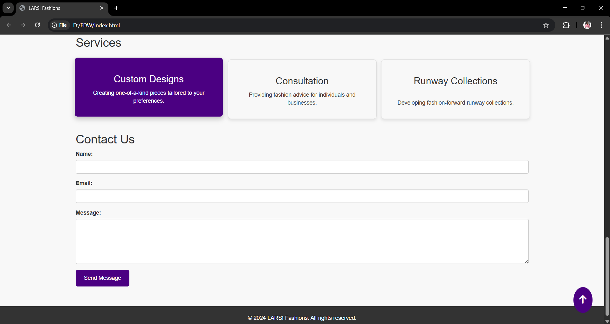

# 💃 Fashion Design Website

A basic responsive fashion design website built using **HTML**, **CSS**, and **JavaScript**. This project showcases the layout and design of a modern fashion brand’s landing page.

---

## 🖼️ Screenshots

# Home Page


# Gallery


# Services


## 🚀 Features

- Responsive layout
- Hero section with CTA
- Fashion gallery

## 🛠️ How to Run Locally

1. Clone the repository:
   ```bash
   git clone https://github.com/asishkumarv/fashion-designing-website.git
2. Navigate to the project folder:
    cd fashion-designing-website
3.Open index.html in your browser:

  You can double-click it

  Or use a local server (recommended):
  # Using VS Code Live Server Extension

📌 Technologies Used

-HTML5

-CSS3 

-JavaScript 

# 🔗 Live Demo
